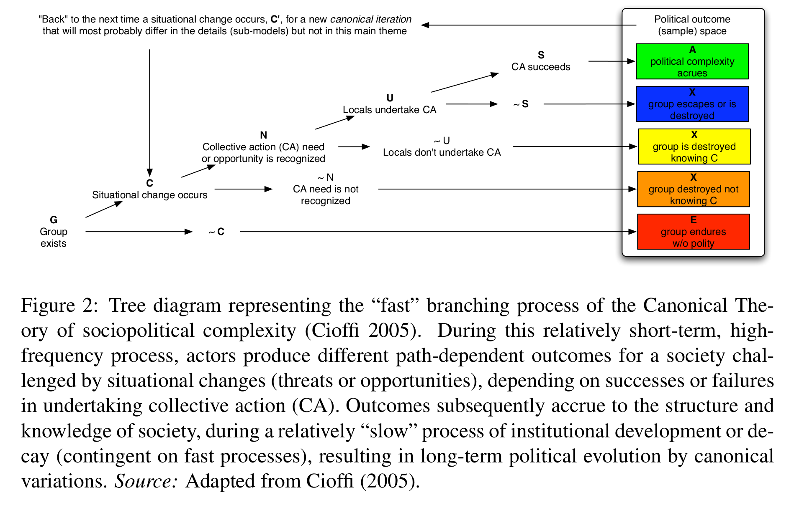
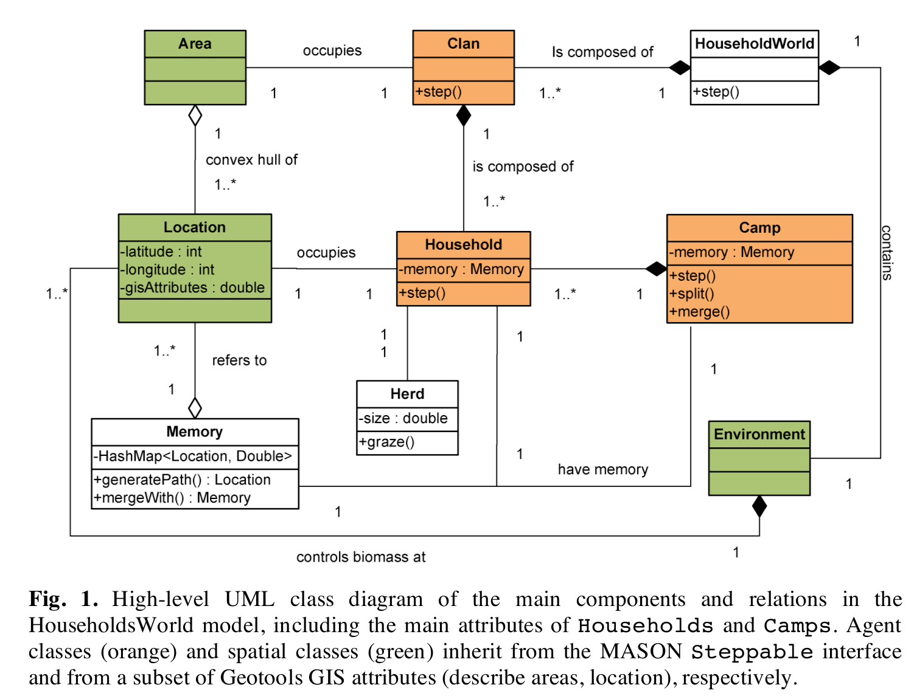
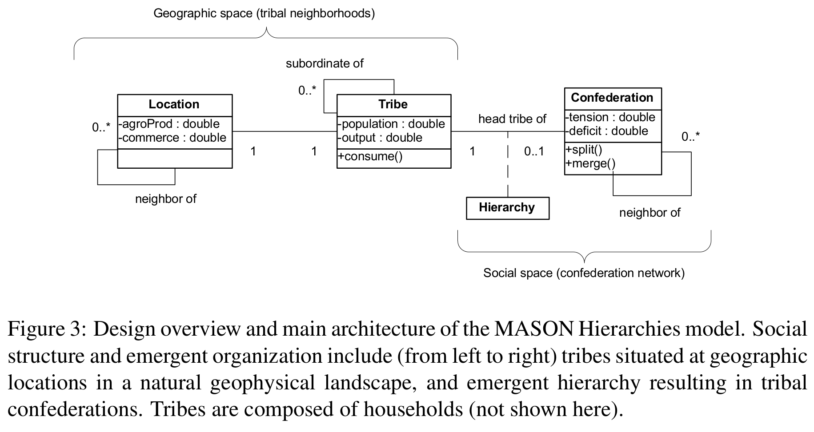
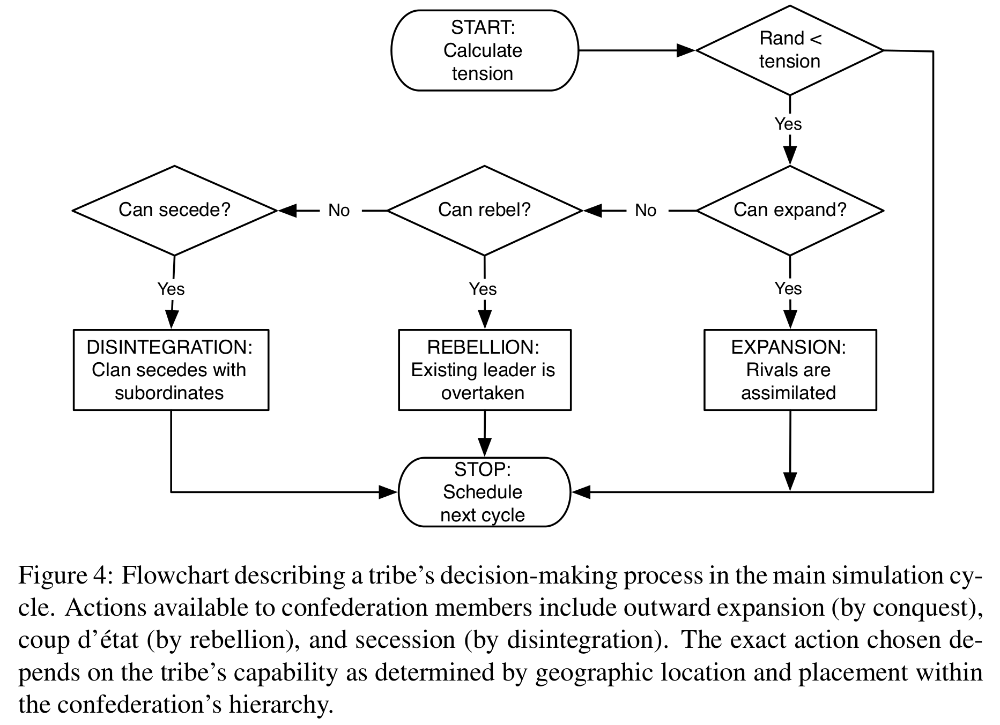

### Summary of "MASON Hierarchies"
   
    
   
* * * * 

C. Cioffi-Revilla, W. Honeychurch, J.D. Rogers (2013)

* * * * 
  
 
 
   
<small> 
[CW Dillon](http://www.css.gmu.edu/?q=node/15) 

for _Conflict Models_, CSS739

Fall 2014

George Mason University
</small>

*** =pnotes

I am a PhD student in the Department of Computational Social Sciences, at the Krasnow Institute for Advanced Studies. We focus our research on understanding complex adaptive social systems from a behavioral (even cognitive) perspective. This seminar, by Dr. Claudio Cioffi-Revilla focuses on models of conflict: statistical models, games and decision models, dynamic models and agent-based models, for example.

--- .class #id 

### A long-range agent model of power, conflict and environment in Inner Asia 

* Builds on a previous model simulating households within the (real) environment in Inner Asia
 - 100 years
 - large area (Kazakstan to Manchuria)
* Implements the _Canonical Theory_ for _tribal-level_ power relationships (including conflict)
* Supports a competing theory about evolution of social complexity in the Steppe

---

### Canonical Theory

--- &vertical

## Model Ontology

* Natural landscape: 
 - biophysical systems; exlusisively Nature
 - no humans or their artifacts
* Humans and kin-based groups: 
 - households with clan membership 
 - indviduals with values, social norms; produce behavior
* Artificial systems: 
 - camps, tribes, federations 
 - emergent phenomena & complex adaptive systems
 - comprises the built environment

***

### Households Model
 

<small>C. Cioffi-Revilla, J.D. Rogers, M. Latek (2010) [1]</small>

***

### Hierarchies Model 
 

<small>C. Cioffi-Revilla, W. Honeychurch, J.D. Rogers (2013)
[2]</small>

--- &vertical

### Key Differences with Previous Modules

* Much more involved than statistical, DM, games, or dynamical models
 - Time (even to replicate)
 - Number of parameters
* Includes or incorporates many of the prior techniques
 - Validation
 - Behavior 

--- &vertical

### Model Features

* Military capacity
* Economy size (power)
* Military burden

***

### Military Capacity

* Tribes have limit on span of control, which impacts military effectiveness

***

### Economic Power

* Tribes need to maintain a flow of wealth 

***

### Military Burden

* Tribes redistribute wealth to pay for military contributions

--- &vertical

### Behavior and Decision-making

* Tribes have a tension to secure wealth
 - by Expansion
 - by Rebellion
 - by Disintigration (failure)
 
 

***

### Tribal Decisions

--- &vertical

### Validation

* Distribution of emergent phenomena metrics
* Time-series and event analysis

***

### Emergent Phenomena

* coalition/confederation size
* tension across tribes; "global"
* effective coalition power
* coalition duration 

***

### Time-series

* Territorial size of confederations over time
* Membership size of coaltions over time
* Tension of coalition members over time
* Jensen-Shannon Divergence 
 - measures similarity between two probability distributions
 

--- &vertical

## Abrupt Ending

 

